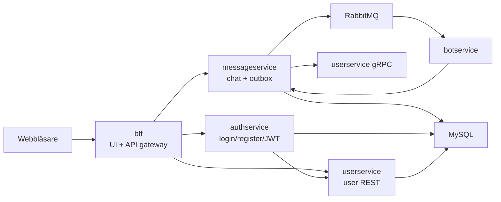

# Labb 2 Microservices Chat

Detta projekt är en mikrotjänstbaserad chattapplikation byggd med Java, Spring Boot, MySQL, RabbitMQ, gRPC, Docker och Kubernetes.

Applikationen låter en användare skapa konto, logga in, välja chattrum och skriva meddelanden. Om ett meddelande innehåller `@bot` publiceras ett event via outbox-mönstret till RabbitMQ, där `botservice` tar emot eventet och skapar ett botsvar i chatten.

Projektet har även stöd för native-images med GraalVM/Spring Boot AOT. Kubernetes-manifestet använder de native-images som byggs lokalt.

## Innehåll

- [Vad appen gör](#vad-appen-gör)
- [Tjänster](#tjänster)
- [Arkitektur](#arkitektur)
- [Användarflöde](#användarflöde)
- [Tekniskt meddelandeflöde](#tekniskt-meddelandeflöde)
- [Databaser och tabeller](#databaser-och-tabeller)
- [Säkerhet](#säkerhet)
- [Bot och AI-läge](#bot-och-ai-läge)
- [Köra med Docker Compose](#köra-med-docker-compose)
- [Köra lokalt i IntelliJ](#köra-lokalt-i-intellij)
- [Köra med Kubernetes](#köra-med-kubernetes)
- [Bygga native-images](#bygga-native-images)
- [API-exempel](#api-exempel)
- [Tester](#tester)
- [Felsökning](#felsökning)

## Vad appen gör

Appen består av en enkel webbchatt där användaren först måste skapa konto eller logga in. Efter inloggning visas chattvyn. Där kan användaren:

- välja rum: `general`, `support` eller `random`
- läsa tidigare meddelanden i valt rum
- skriva nya meddelanden
- skicka med Enter
- använda Shift+Enter för ny rad
- skriva `@bot` för att trigga ett botsvar
- logga ut

Webbgränssnittet finns i `bff/src/main/resources/static` och serveras av BFF-tjänsten.

## Tjänster

| Tjänst | Port lokalt | Port i Kubernetes | Ansvar |
| --- | ---: | ---: | --- |
| `bff` | `8080` | `30080` via NodePort | Webb-UI och API-gateway för frontend |
| `authservice` | `9000` | internt `9000` | Registrering, login, JWT och JWKS |
| `userservice` | `8083` | internt `8083` | Användarprofiler via REST och gRPC |
| `messageservice` | `8081` | internt `8081` | Meddelanden, rum, outbox och RabbitMQ-publicering |
| `botservice` | `8082` | internt `8082` | Lyssnar på RabbitMQ-event och skapar botsvar |
| MySQL | `3306` | internt `3306` | Databaser för auth, users och messages |
| RabbitMQ | `5672`, `15672` | internt `5672`, `15672` | Eventkö och management UI |

I normal användning ska webbläsaren bara prata med `bff`. De andra tjänsterna är interna.

## Arkitektur



## Användarflöde

1. Användaren öppnar webbappen.
2. Om ingen giltig session finns visas loginvyn.
3. Användaren kan skapa konto med användarnamn, visningsnamn och lösenord.
4. BFF skickar registreringen till `authservice`.
5. `authservice` skapar först en användarprofil i `userservice`.
6. `authservice` sparar sedan inloggningsuppgifterna i `auth_db`.
7. `authservice` returnerar en JWT access token.
8. BFF/frontenden sparar token i `localStorage`.
9. Chatten visas.
10. När användaren skickar meddelanden skickas token med som `Authorization: Bearer ...`.
11. BFF läser ut `userId` från JWT och skickar meddelandet vidare till `messageservice`.
12. `messageservice` slår upp användarnamn via gRPC mot `userservice`.
13. Meddelandet sparas i databasen och visas i chatten.

Sessionen ligger i webbläsarens `localStorage` och återställs automatiskt efter omladdning så länge token inte har gått ut. Token gäller i 1 timme.

## Tekniskt meddelandeflöde

När ett vanligt meddelande skickas:

1. Frontend skickar `POST /api/messages` till BFF.
2. BFF kontrollerar JWT och skickar vidare till `messageservice`.
3. `messageservice` sparar meddelandet i tabellen `messages`.
4. I samma transaktion skapas också ett event i tabellen `outbox_events`.
5. `OutboxRelay` kör schemalagt och letar efter `PENDING` event.
6. Eventet publiceras till RabbitMQ.
7. RabbitMQ bekräftar publiceringen.
8. Outbox-eventet markeras som `PROCESSED`.

När meddelandet innehåller `@bot`:

1. `botservice` tar emot `MessagePublishedEvent` från RabbitMQ.
2. Om avsändaren redan är botten ignoreras eventet för att undvika loop.
3. Om texten inte innehåller `@bot` ignoreras eventet.
4. Om texten innehåller `@bot` skapas ett botsvar.
5. `botservice` skickar botsvaret tillbaka till `messageservice`.
6. `messageservice` sparar botmeddelandet i samma chattrum.
7. Frontendens auto-refresh hämtar svaret och visar det.

## Databaser och tabeller

MySQL används med tre databaser:

| Databas | Ägare | Innehåll |
| --- | --- | --- |
| `users_db` | `userservice` | användarprofiler |
| `auth_db` | `authservice` | loginuppgifter och koppling till user-id |
| `messages_db` | `messageservice` | chattmeddelanden och outbox-events |

Databasscheman hanteras med Flyway i respektive modul. Hibernate körs med `ddl-auto=validate`, vilket betyder att Spring inte automatiskt skapar eller ändrar tabeller vid start. Om tabeller saknas ska Flyway-migrationerna eller Kubernetes-initjobbet skapa dem.

I Kubernetes finns dessutom ett `mysql-init-databases` Job i `k8s/labb2.yaml`. Det skapar databaserna och de viktigaste tabellerna idempotent så att native-tjänsterna kan starta även i ett tomt lokalt kluster.

## Säkerhet

Applikationen använder flera säkerhetslager:

- Användare loggar in via `authservice`.
- Lösenord sparas hashade.
- `authservice` utfärdar JWT med ES256-signering.
- BFF validerar JWT mot `authservice` JWKS endpoint: `/auth/jwks`.
- BFF skickar interna anrop vidare med headern `X-Internal-Api-Key`.
- Interna tjänster kräver samma interna API-nyckel.
- Authservice sparar sin signeringsnyckel på disk eller PVC så att token inte blir ogiltiga vid varje omstart.

Hemliga värden ska inte ligga i `application.properties`, `docker-compose.yml` eller `k8s/labb2.yaml`.
Projektet läser dem i stället från:

- Docker Compose secrets i `secrets/*.txt`
- miljövariabler när du kör tjänster direkt i IntelliJ
- Kubernetes `Secret`-objekt i klustret

## Bot och AI-läge

Som standard kör botten i regelbaserat läge. Då svarar den med fasta, men lite varierade, standardsvar beroende på meddelandet:

- hälsningar som `hej`
- frågor som `hur mår du`
- ord som `hjälp`
- ord som `test`
- tack eller hejdå

Botten svarar bara när meddelandet innehåller `@bot`.

Det finns även stöd för AI-svar via OpenRouter. Det är avstängt som standard. Om AI-läget är aktivt och API-anropet misslyckas faller botten tillbaka till regelbaserade svar. Om AI-läget är aktivt men API-nyckel saknas kommer `botservice` inte kunna starta korrekt.

### Aktivera AI med Docker Compose

PowerShell:

```powershell
$env:BOT_AI_ENABLED="true"
$env:OPENROUTER_API_KEY="din-api-nyckel"
docker compose up --build
```

### Aktivera AI i Kubernetes

Skapa en secret:

```powershell
kubectl create secret generic bot-ai-secret `
  -n labb2 `
  --from-literal=OPENROUTER_API_KEY="din-api-nyckel"
```

Ändra sedan `BOT_AI_ENABLED` i `k8s/labb2.yaml` från `"false"` till `"true"` och applicera manifestet:

```powershell
kubectl apply -f k8s\labb2.yaml
kubectl rollout restart deployment/botservice -n labb2
```

## Köra med Docker Compose

Docker Compose är enklaste sättet att köra hela systemet utan Kubernetes.

### Förutsättningar

- Docker Desktop
- Lediga portar: `8080`, `8081`, `8082`, `8083`, `9000`, `3306`, `5672`, `15672`

### Starta

Första gången behöver du skapa lokala secret-filer. De ignoreras av git.

```powershell
New-Item -ItemType Directory -Force secrets

[Convert]::ToBase64String([Security.Cryptography.RandomNumberGenerator]::GetBytes(32)) |
  Set-Content -NoNewline secrets\mysql-root-password.txt

"labb2_rabbit" |
  Set-Content -NoNewline secrets\rabbitmq-username.txt

[Convert]::ToBase64String([Security.Cryptography.RandomNumberGenerator]::GetBytes(24)) |
  Set-Content -NoNewline secrets\rabbitmq-password.txt

[Convert]::ToBase64String([Security.Cryptography.RandomNumberGenerator]::GetBytes(32)) |
  Set-Content -NoNewline secrets\internal-api-key.txt

[Convert]::ToBase64String([Security.Cryptography.RandomNumberGenerator]::GetBytes(32)) |
  Set-Content -NoNewline secrets\auth-oauth-client-secret.txt
```

Starta sedan från projektroten:

```powershell
docker compose up --build
```

Öppna sedan:

```text
http://localhost:8080
```

RabbitMQ Management finns här:

```text
http://localhost:15672
```

Login:

```text
användarnamn från secrets\rabbitmq-username.txt
lösenord från secrets\rabbitmq-password.txt
```

### Stoppa

```powershell
docker compose down
```

Om du vill ta bort volymer och börja om med tom databas:

```powershell
docker compose down -v
```

## Köra lokalt i IntelliJ

Det här passar när du vill debugga tjänsterna en och en.

### 1. Starta infrastruktur

Starta bara MySQL och RabbitMQ:

```powershell
docker compose up mysql rabbitmq
```

Eftersom appens hemligheter inte längre har dev-fallbacks behöver IntelliJ-konfigurationerna få miljövariabler.
Det enklaste är att läsa samma lokala secret-filer och lägga värdena i varje Run Configuration som behöver dem.

Gemensamma värden:

```powershell
$env:SPRING_DATASOURCE_USERNAME="root"
$env:SPRING_DATASOURCE_PASSWORD=(Get-Content secrets\mysql-root-password.txt -Raw)
$env:SPRING_RABBITMQ_USERNAME=(Get-Content secrets\rabbitmq-username.txt -Raw)
$env:SPRING_RABBITMQ_PASSWORD=(Get-Content secrets\rabbitmq-password.txt -Raw)
$env:INTERNAL_API_KEY=(Get-Content secrets\internal-api-key.txt -Raw)
$env:AUTH_OAUTH_CLIENT_SECRET=(Get-Content secrets\auth-oauth-client-secret.txt -Raw)
```

I IntelliJ sätter du normalt:

- `userservice`: `SPRING_DATASOURCE_USERNAME`, `SPRING_DATASOURCE_PASSWORD`, `INTERNAL_API_KEY`
- `authservice`: `SPRING_DATASOURCE_USERNAME`, `SPRING_DATASOURCE_PASSWORD`, `INTERNAL_API_KEY`, `AUTH_OAUTH_CLIENT_SECRET`
- `messageservice`: `SPRING_DATASOURCE_USERNAME`, `SPRING_DATASOURCE_PASSWORD`, `SPRING_RABBITMQ_USERNAME`, `SPRING_RABBITMQ_PASSWORD`, `INTERNAL_API_KEY`
- `botservice`: `SPRING_RABBITMQ_USERNAME`, `SPRING_RABBITMQ_PASSWORD`, `INTERNAL_API_KEY`
- `bff`: `INTERNAL_API_KEY`

### 2. Starta tjänsterna i IntelliJ

Starta modulerna i ungefär denna ordning:

1. `userservice`
2. `authservice`
3. `messageservice`
4. `botservice`
5. `bff`

Öppna sedan:

```text
http://localhost:8080
```

### 3. Lokala standardportar

| Modul | Port |
| --- | ---: |
| `bff` | `8080` |
| `messageservice` | `8081` |
| `botservice` | `8082` |
| `userservice` | `8083` |
| `authservice` | `9000` |

Om en port redan används måste den processen stoppas eller porten ändras i modulens `application.properties`.

## Köra med Kubernetes

Kubernetes-manifesten ligger i `k8s/`.

Huvudmanifest:

```text
k8s/labb2.yaml
```

Valfritt Gateway API-manifest för Traefik:

```text
k8s/labb2-gateway-traefik.yaml
```

### Förutsättningar

- Docker Desktop
- Kubernetes aktiverat i Docker Desktop
- `kubectl` fungerar mot Docker Desktop-klustret
- Native-images finns lokalt, eller byggs enligt avsnittet [Bygga native-images](#bygga-native-images)

Kontrollera klustret:

```powershell
kubectl get nodes
```

### Starta appen i Kubernetes

```powershell
kubectl create namespace labb2 --dry-run=client -o yaml | kubectl apply -f -

$mysqlPassword = [Convert]::ToBase64String([Security.Cryptography.RandomNumberGenerator]::GetBytes(32))
$rabbitPassword = [Convert]::ToBase64String([Security.Cryptography.RandomNumberGenerator]::GetBytes(24))
$internalApiKey = [Convert]::ToBase64String([Security.Cryptography.RandomNumberGenerator]::GetBytes(32))
$oauthClientSecret = [Convert]::ToBase64String([Security.Cryptography.RandomNumberGenerator]::GetBytes(32))

kubectl create secret generic labb2-secret `
  -n labb2 `
  --from-literal=mysql-root-password="$mysqlPassword" `
  --from-literal=rabbitmq-username="labb2_rabbit" `
  --from-literal=rabbitmq-password="$rabbitPassword" `
  --from-literal=internal-api-key="$internalApiKey" `
  --from-literal=auth-oauth-client-secret="$oauthClientSecret"

kubectl apply -f k8s\labb2.yaml
```

Vänta tills allt är redo:

```powershell
kubectl get pods -n labb2
```

Alla relevanta pods ska visa `1/1 Running`, och initjobbet ska visa `Completed`.

Öppna appen:

```text
http://localhost:30080
```

### Stoppa eller rensa Kubernetes-miljön

Stoppa hela labbmiljön genom att ta bort namespacet:

```powershell
kubectl delete namespace labb2
```

Detta tar även bort lokala PVC:er i namespace `labb2`, så databasinnehåll försvinner i den lokala Kubernetes-miljön.

### Traefik och Gateway API

`k8s/labb2-gateway-traefik.yaml` är förberedd för Traefik med Gateway API. Den ska bara appliceras om Gateway API CRDs och Traefik Gateway Controller finns installerade.

Basappen kräver inte Gateway API. Lokalt räcker BFF som `NodePort` på `30080`.

## Bygga native-images

Kubernetes-manifestet använder dessa images:

```text
labb2-userservice:native
labb2-authservice:native
labb2-messageservice:native
labb2-botservice:native
labb2-bff:native
```

På grund av nuvarande builder-stöd används Java 25 vid native-build, även om projektets `pom.xml` anger Java 26.

Kör helst native-byggen när Kubernetes är nedskalat eller avstängt, eftersom GraalVM native-image kan använda mycket minne.

### Skala ner Kubernetes innan native-build

Om appen redan körs i Kubernetes:

```powershell
kubectl scale deployment userservice authservice messageservice botservice bff -n labb2 --replicas=0
kubectl scale statefulset mysql rabbitmq -n labb2 --replicas=0
```

### Byggkommandon

Kör ett kommando i taget från respektive modulmapp.

`userservice`:

```powershell
cd userservice
mvn clean -Pnative spring-boot:build-image -DskipTests "-Djava.version=25" "-Dspring-boot.build-image.imageName=labb2-userservice:native"
cd ..
```

`authservice`:

```powershell
cd authservice
mvn clean -Pnative spring-boot:build-image -DskipTests "-Djava.version=25" "-Dspring-boot.build-image.imageName=labb2-authservice:native"
cd ..
```

`messageservice`:

```powershell
cd messageservice
mvn clean -Pnative spring-boot:build-image -DskipTests "-Djava.version=25" "-Dspring-boot.build-image.imageName=labb2-messageservice:native"
cd ..
```

`botservice`:

```powershell
cd botservice
mvn clean -Pnative spring-boot:build-image -DskipTests "-Djava.version=25" "-Dspring-boot.build-image.imageName=labb2-botservice:native"
cd ..
```

`bff`:

```powershell
cd bff
mvn clean -Pnative spring-boot:build-image -DskipTests "-Djava.version=25" "-Dspring-boot.build-image.imageName=labb2-bff:native"
cd ..
```

### Om build fastnar på EXPORTING

Ibland kan Paketo/Spring Boot build-image bli klar med själva native-binären men fastna i steget `EXPORTING`. Då brukar loggen visa något i stil med:

```text
Finished generating 'org.example...Application'
===> EXPORTING
```

Om det händer finns `Dockerfile.native-runtime` i modulerna som fallback. Gör så här:

1. Hitta buildercontainern:

```powershell
docker ps
```

2. Kopiera ut native-runtime-lagret:

```powershell
docker cp <builder-container-name>:/layers/paketo-buildpacks_native-image/native-image .\target\native-runtime
```

3. Bygg imagen manuellt:

```powershell
docker build -f Dockerfile.native-runtime -t labb2-<modulnamn>:native .
```

4. Stoppa buildercontainern:

```powershell
docker stop <builder-container-name>
```

Exempel för BFF:

```powershell
cd bff
docker cp great_stonebraker:/layers/paketo-buildpacks_native-image/native-image .\target\native-runtime
docker build -f Dockerfile.native-runtime -t labb2-bff:native .
docker stop great_stonebraker
cd ..
```

## API-exempel

Normalt används UI:t, men det går också att testa via PowerShell.

### Docker Compose

Använd port `8080`:

```powershell
$baseUrl = "http://localhost:8080"
```

### Kubernetes

Använd port `30080`:

```powershell
$baseUrl = "http://localhost:30080"
```

### Skapa användare

```powershell
$registerBody = @{
  username = "martin"
  displayName = "Martin"
  password = "password"
} | ConvertTo-Json

$session = Invoke-RestMethod `
  -Method Post `
  -Uri "$baseUrl/api/register" `
  -ContentType "application/json" `
  -Body $registerBody
```

### Logga in

```powershell
$loginBody = @{
  username = "martin"
  password = "password"
} | ConvertTo-Json

$session = Invoke-RestMethod `
  -Method Post `
  -Uri "$baseUrl/api/login" `
  -ContentType "application/json" `
  -Body $loginBody
```

### Skicka meddelande

```powershell
$messageBody = @{
  room = "general"
  content = "Hej @bot"
} | ConvertTo-Json

Invoke-RestMethod `
  -Method Post `
  -Uri "$baseUrl/api/messages" `
  -Headers @{ Authorization = "Bearer $($session.accessToken)" } `
  -ContentType "application/json" `
  -Body $messageBody
```

### Hämta meddelanden

```powershell
Invoke-RestMethod `
  -Method Get `
  -Uri "$baseUrl/api/messages?room=general" `
  -Headers @{ Authorization = "Bearer $($session.accessToken)" }
```

## Tester

Kör tester per modul:

```powershell
cd userservice
mvn test "-Djava.version=25"
cd ..

cd authservice
mvn test "-Djava.version=25"
cd ..

cd messageservice
mvn test "-Djava.version=25"
cd ..

cd botservice
mvn test "-Djava.version=25"
cd ..

cd bff
mvn test "-Djava.version=25"
cd ..
```

## Felsökning

### Porten är upptagen

Om en tjänst inte startar kan en port redan vara upptagen. Vanliga portar:

```text
8080, 8081, 8082, 8083, 9000, 3306, 5672, 15672, 30080
```

Stoppa processen som använder porten, eller ändra `server.port` i berörd modul.

### Databasen innehåller gamla tabeller eller data

Docker Compose:

```powershell
docker compose down -v
docker compose up --build
```

Kubernetes:

```powershell
kubectl delete namespace labb2
kubectl apply -f k8s\labb2.yaml
```

### RabbitMQ startar långsamt

RabbitMQ kan ta längre tid att starta i Docker Desktop, särskilt efter native-builds eller om Docker har lite minne. Kubernetes-manifestet använder TCP-probes och längre liveness-marginal för att undvika onödiga restarts.

Kontrollera status:

```powershell
kubectl get pods -n labb2
kubectl logs rabbitmq-0 -n labb2
```

### Botten svarar inte

Kontrollera:

1. Innehåller meddelandet `@bot`?
2. Är RabbitMQ redo?
3. Kör `botservice`?
4. Har outbox-eventet publicerats?

Kommandon:

```powershell
kubectl logs deployment/messageservice -n labb2 --since=10m
kubectl logs deployment/botservice -n labb2 --since=10m
```

### Native-build får Java-versionfel

Om du ser fel om class file version eller Java 26/25, bygg med:

```powershell
"-Djava.version=25"
```

Exempel:

```powershell
mvn clean -Pnative spring-boot:build-image -DskipTests "-Djava.version=25" "-Dspring-boot.build-image.imageName=labb2-bff:native"
```

### Native-build tar mycket tid

Det är normalt att native-build tar flera minuter per modul. Tjänster med JPA, Flyway, gRPC och security är tyngre. Docker Desktop bör ha gott om minne, gärna runt 8 GB eller mer.

Skala ner Kubernetes innan du bygger native-images om Docker Desktop känns segt:

```powershell
kubectl scale deployment userservice authservice messageservice botservice bff -n labb2 --replicas=0
kubectl scale statefulset mysql rabbitmq -n labb2 --replicas=0
```

### Kontrollera vilka images som finns

```powershell
docker images | findstr labb2
```

### Kontrollera Kubernetes-status

```powershell
kubectl get pods,svc,pvc,jobs -n labb2
```

## Kort sammanfattning

För vanlig lokal körning:

```powershell
docker compose up --build
```

Öppna:

```text
http://localhost:8080
```

För Kubernetes:

```powershell
kubectl apply -f k8s\labb2.yaml
```

Öppna:

```text
http://localhost:30080
```
